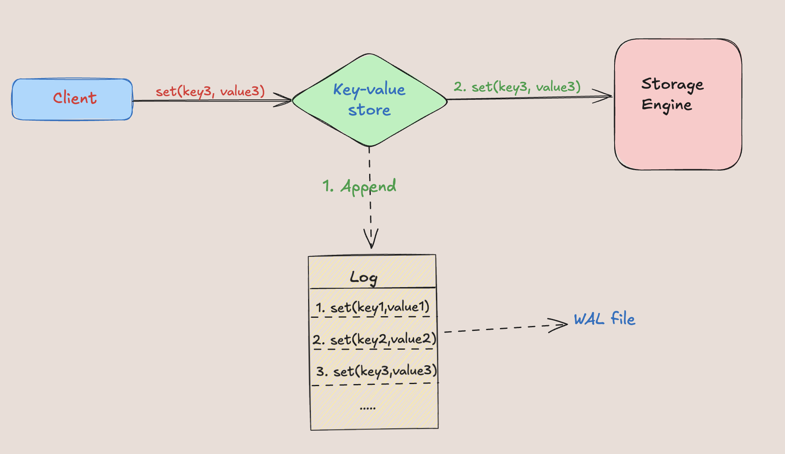

# WAL

Build a simple write-ahead log storage in Go.

> [!Note]
>
> This project is started for an educational purposes to learn more about internals of databases and to get the hands dirty.

## Introduction to WAL

- Write-Ahead-Log(WAL) is an essential component for the durability for databases.
- WALs are more generally used in database systems to flush all written data to disk(non-volatile storage) before the changes are written to the database. So that in case of a crash, lost in-memory changes of database can be recovered using logs.
- WAL file can be read during the restart and state can be recovered just by replaying all the log entries.

  

## More Details about WAL

- WAL is more than just a log entries example:

  - WAL is used in LSM trees for reliability.
  - Moreover, [RAFT](https://en.wikipedia.org/wiki/Raft_(algorithm)) algorithm uses replicated WALs to achieve consensus in distributed system with the help of log replication.
  - For more informartion on usage of WAL, please refer to [this blog of netflix](https://netflixtechblog.com/building-a-resilient-data-platform-with-write-ahead-log-at-netflix-127b6712359a).
- Generally WAL files uses append-only file technique, which is basically to append every new entry to the end of the current file.
- The main disadvantage of this append only method is that it will keep growing as data cannot be modified or deleted, hence it can lead to a large number of files, which can make it difficult to manage. To solve such issues techiniques like `Segmented Log` and `Low-Water-Mark` are used.

  - **Segmented Log**: A single log file can grow and become very large which makes periodic cleanup operation difficult, so single log file is split into multiple segments. When the WAL segment file reaches a configurable maximum size, it is closed and the WAL starts to append its records to a new and empty file. These files are called WAL  *segments.*
  - **Low-Water Mark**: It's lowest offset/index or low-water mark in WAL to tell the logging mechanism which portion of log can be safely discarded.

## Implementation Details

Please refer to [this](./pkg/Implementation.md) doc for WAL file format and other implementation details.

## Features

- [ ] Efficient and safe Write-Ahead Log for databases
- [ ] Log Segmentation
- [ ] Integrity check
- [ ] Repair of corrupt wal file

## References

- [https://www.postgresql.org/docs/9.1/wal-intro.html](https://www.postgresql.org/docs/9.1/wal-intro.html)
- [Patterns of Distributed Systems](https://martinfowler.com/books/patterns-distributed.html)
- [Etcd&#39;s wal implementation](https://github.com/liqingqiya/readcode-etcd-v3.4.10/blob/master/src/go.etcd.io/etcd/wal/decoder.go#L35)

## Contributing

I'm sharing this as a starting point for others to learn more about internals of database, and also to gather feedback to learn more. If you have a suggestion, feel free to [file an issue](https://github.com/ishan16696/wal/issues).

## License

This project is licensed under the MIT License. See the [LICENSE](https://github.com/ishan16696/wal/blob/main/LICENSE) file for details.
