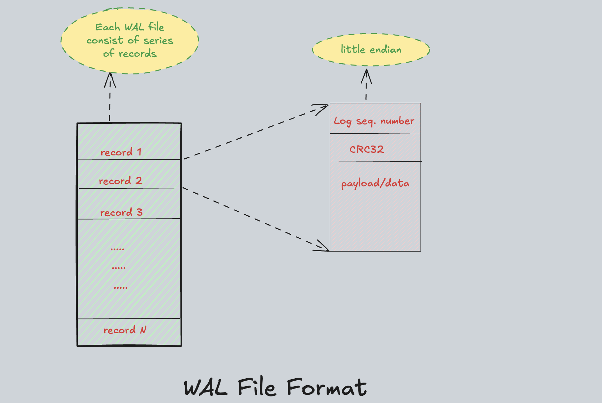

### Implementation considerations

- **Write operations:** Flushing the logs to disk(non-volatile storage) is done using [fsync](https://en.wikipedia.org/wiki/Fsync). But there is a tradeoff:
  - Flushing every log write to disk gives very strong durability but this limits the write performance. If flushing is done periodically (with a set-interval), it improves the write performance but there is a risk of losing entries (if server crashed before flushing).
  - [Fsync](https://en.wikipedia.org/wiki/Fsync): OS also use their own buffers for disk file operations, which means data written to disk might initially only be stored in an OS buffer and can be lost in case of power failure. To address this, operating systems provide an fsync API to force the synchronization of the OS buffer with the disk. However, fsync can slow down write operations.
  - So, there always will be a tradeoff between write operations performance and durability. So, we need to have a balance b/w both depends on the usecase.
- **Serialization**: Data written to disk must be serialize. Many systems use [Google protobuf](https://protobuf.dev/) for this purpose, which provides rapid serialization and efficient encoding.
- **Concurrency**: WAL file can be opened either in read mode or write(append) mode but not both. Simultaneous read and write operations are not permitted as it will never be required because WAL file are only read during start-up.
- **Integrity**: To ensure the integrity of entries, each log entry should include a checksum which can be verified during the file read and can detect the corrupted entries.

## WAL File Format

- Here, I'm simply taking the simple wal file format. This diagram shows detailed format of the WAL file consider in this project.

  

- Each WAL file consists of a series of records. It’s encoded in little endian.
- The first 4 bytes(32bit) in each record is the log sequence number(offset), in order to implement the low-water mark.
- Then next field is used for CRC, 4 bytes(32bit) CRC32 checksum of record data.
- Last field will contain the actual payload.
- WAL file format can contain more information which is essential to contain other information about database, take a look at [etcd wal file](https://github.com/ahrtr/etcd-issues/blob/master/docs/cncf_storage_tag_etcd.md#storage-wal-file-format).