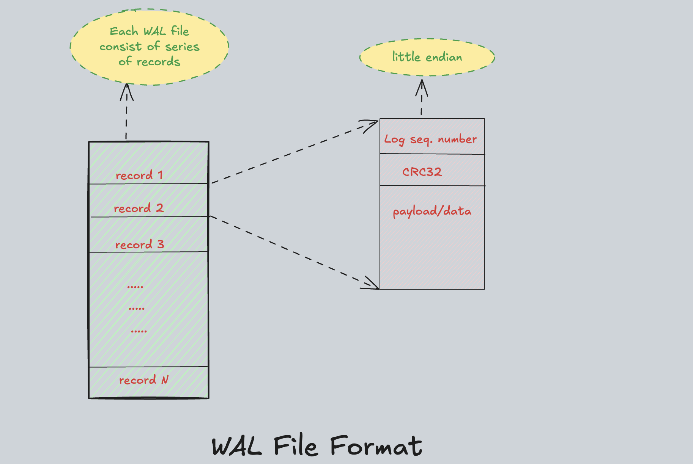

# Implementation considerations

- WAL Looks simple and great in [theory](../README.md#introduction-to-wal) but what's in practice ?

## WAL and Page cache

- Database developers know that the kernel doesn’t write data to disk on every write syscall. The data is just written into page cache(residing in RAM) unless [O_DIRECT](https://man7.org/linux/man-pages/man2/open.2.html)(direct IO) is used. So, data written into WAL file may disappear on power loss. So, to avoid data loss and ensure durability we have to explicitly tell the kernel to flush recently written data from page cache to disk via [fsync](https://en.wikipedia.org/wiki/Fsync) syscall.
- **Write operations:** Flushing the logs to disk(non-volatile storage) is done using [fsync](https://en.wikipedia.org/wiki/Fsync). But there is a tradeoff:
  - Flushing every log write to disk gives very strong durability but this limits the write performance. If flushing is done periodically (with a set-interval), it improves the write performance but there is a risk of losing entries (if server crashed before flushing).
  - So, there always will be a tradeoff between write operations performance and durability. So, we need to have a balance b/w both depends on the usecase.
  - **example**: Cassandra by default calls fsync on WAL only every 10 seconds. Moreoever, Prometheus calls fsync only after big chunk of data (aka segment) is written into WAL.

## Serialization

Data written to disk must be serialize. Many systems use [Google protobuf](https://protobuf.dev/) for this purpose, which provides rapid serialization and efficient encoding.

## Concurrency

WAL file can be opened either in read mode or write(append) mode but not both. Simultaneous read and write operations are not permitted as it will never be required because WAL file are only read during start-up.

## Integrity

To ensure the integrity of entries, each log entry should include a checksum which can be verified during the file read and can detect the corrupted entries.

## WAL File Format

- Here, I'm simply taking the simple wal file format. This diagram shows detailed format of the WAL file consider in this project.

  

- Each WAL file consists of a series of records. It’s encoded in little endian.
- The first 4 bytes(32bit) in each record is the log sequence number(offset), in order to implement the low-water mark.
- Then next field is used for CRC, 4 bytes(32bit) CRC32 checksum of record data.
- Last field will contain the actual payload.
- WAL file format can contain more information which is essential to contain other information about database, take a look at [etcd wal file](https://github.com/ahrtr/etcd-issues/blob/master/docs/cncf_storage_tag_etcd.md#storage-wal-file-format).